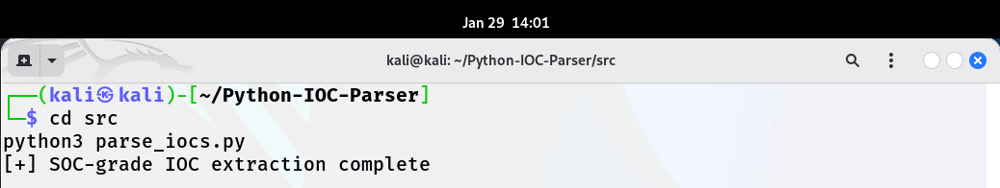
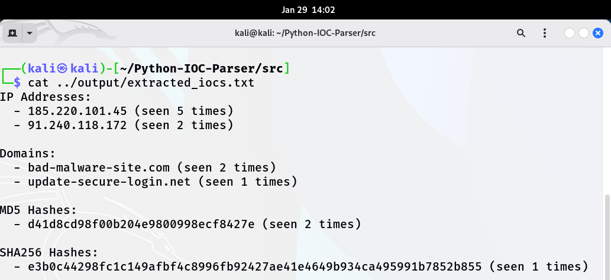
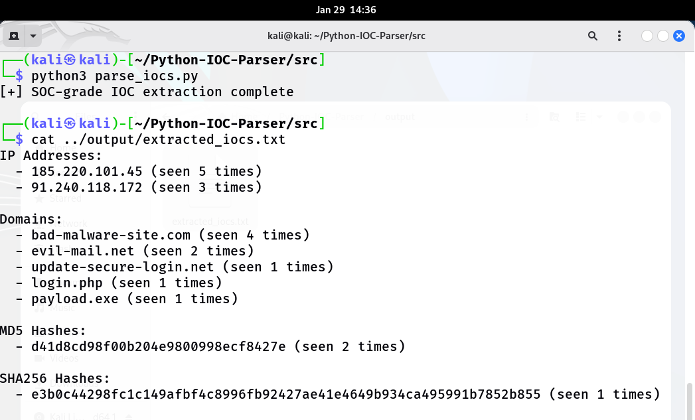

# Python IOC Parser

## Overview
This project is a SOC-grade Python tool for automated extraction of Indicators of Compromise (IOCs) from system and network logs. It is designed to handle small lab datasets as well as extended enterprise-style logs, simulating realistic SOC log analysis conditions.

The tool extracts the following IOCs:
- IP addresses
- Domains
- MD5 hashes
- SHA256 hashes

The extended version can scale to higher log volumes while maintaining accuracy, enabling analysts to quickly prioritize alerts and IOCs.

---

## Directory Structure
data/ # Sample or test logs
data_extended/ # Enterprise-style extended logs
notes/ # Analyst observations and notes
screenshots/ # Key screenshots for documentation
src/ # Python script: parse_iocs.py
README.md

---

## How It Works

1. Input logs (sample or enterprise) are placed in `data/` or `data_extended/`.
2. `parse_iocs.py` uses Python regex to extract:
   - IP Addresses
   - Domains
   - MD5 Hashes
   - SHA256 Hashes
3. Extracted IOCs are saved in `output/extracted_iocs.txt`.
4. Analysts can review IOCs and prioritize SOC response.

---

## Screenshots & Observations

1. **Script Execution (Initial Dataset)**
   
   *Parser run on small dataset; verifies code functionality.*

2. **Output Results (Initial Dataset)**
   
   *Shows extracted IPs, domains, and hashes.*

3. **Extended Dataset Execution**
   
   *SOC-grade analysis on enterprise-style logs; higher volume and more realistic IOC extraction.*

---

## Analyst Notes

See `notes/Analyst_Observations.md` for detailed SOC-style observations, threat assessment, and extended dataset analysis.

---

## SOC Value

- Automates IOC extraction
- Reduces manual log triage time
- Handles realistic enterprise-scale log volumes
- Prioritizes high-risk indicators for SOC response

